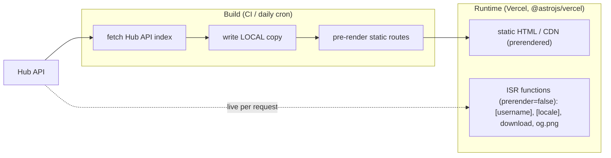
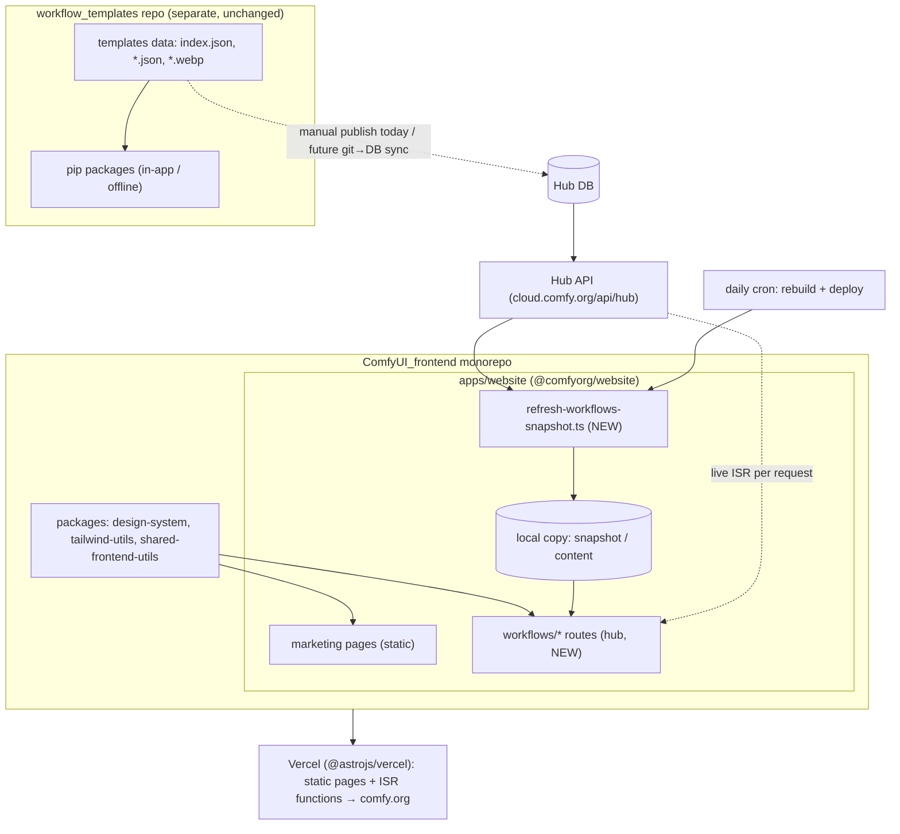
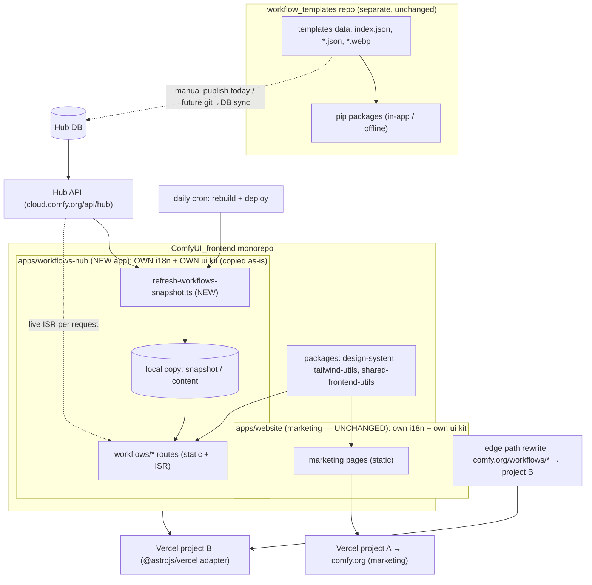
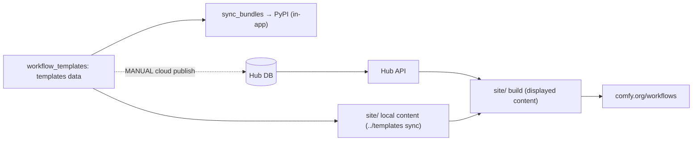
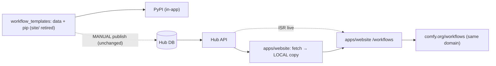
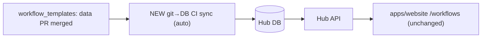

# Research Dossier & Migration Plan — Copying the Workflow Hub frontend into `comfyui_frontend`

> **Purpose / how to use this doc.** This is a **handoff document**. It captures the full,
> grounded research behind copying the ComfyUI workflow-hub website into the `comfyui_frontend`
> monorepo, so that a _fresh_ chat writing the **Technical Design Document (TDD)** has complete
> context without redoing the investigation. Every non-obvious claim cites a real file
> (and line where useful). It is organized **by topic** — each section carries its decision,
> diagram(s), table(s), supporting evidence, and open items **together**; pure reference
> inventories live in the appendices. Items marked **[OPEN]** are intentionally left for the TDD.
>
> Phase context: this is RFC **Phase 2 — "Consolidate: move the website into the frontend
> monorepo."** Publishing / share-metadata / admin / DB consolidation (RFC Phases 1/3/4) are
> explicitly **out of scope**.
>
> Research basis: direct file reads + 8 sub-agent investigations (source `src/` map, source
> supporting-files map, target-conventions map, data/API/local map, i18n+design map, git/prior-work
> map, and 2 architecture stress-tests). Verified against the actual repos on disk on 2026-06-27.
>
> ---
>
> **📌 Document freshness / provenance** (re-verify against newer HEADs if much time has passed)
>
> - **Authored:** 2026-06-27 22:28 IST.
> - **Research method:** direct reads of the working trees on disk at that time + 8 sub-agents.
> - **SOURCE `workflow_templates`** on disk: branch `main` @ **`bced9629`** ("Split workflow JSON
>   from legacy media pip bundles (#978)", 2026-06-27 18:22 +0800). ⚠️ The migration-relevant
>   **redesign + design-token-alignment** work (UI polish; commit `13fba4f1 refactor(site): align
design tokens with comfy.org`) lives on branch **`feat/comfyhub-redesign`** (session metadata
>   initially reported this branch). Structural findings here — routes, data model, hub API,
>   i18n, conventions — hold on both; **component-level styling/variants may differ**. The TDD
>   should confirm the canonical branch to copy from (likely `feat/comfyhub-redesign`).
> - **TARGET `ComfyUI_frontend`** on disk: branch `main` @ **`3377b8e07`** ("feat(publish): prefill
>   prior metadata and update published workflows in place (#13139)", 2026-06-27 05:14 +0000).

---

## 🎯 What this migration targets (and what it deliberately doesn't) — READ FIRST

**What we ARE targeting.** Copy the workflow-hub **frontend** (the Astro `/workflows/*` app at
`workflow_templates/site`) into the `comfyui_frontend` monorepo, so the hub is served from that repo
alone. The concrete wins:

- **Decouple** the hub frontend from `workflow_templates` CI (today website devs work cross-repo).
- **Reuse design/components** with the marketing site (shared `@comfyorg/design-system` tokens, one `ui/`
  kit, `tailwind-utils`) — the core reason to co-locate.
- **Single domain** — `comfy.org/workflows` served from inside `comfyui_frontend`.

This is exactly **RFC Phase 2 — "Consolidate: move website into the frontend monorepo."**

> **Notion RFC** — Deep Mehta, _"Workflow Hub Consolidation + Shared-App Metadata"_ (2026-06-22),
> Rough-sequence table: **"Phase 2 · Consolidate — move website into the frontend monorepo · admin-panel polish."**

> **Slack** (`templates/WorkflowHubMigration.md`):
>
> - DrJKL/Alex: _"Can we put it into the frontend repo? … The astro pieces."_ — Jacob Segal: _"That definitely seems reasonable to me."_
> - Christian Byrne: _"It would make things easier for frontend development if we moved to the hub API because then the hub app would not be coupled to workflow templates repo CI and we could move it into our monorepo (currently, website devs have to work cross repo)."_

**What this migration is NOT — the data-sync pain is the _next_ step (separate phase).** The deeper pain
— that the git `workflow_templates` data and the cloud **Hub DB are two source-of-truths that drift**, so
a workflow gets published **twice** and updates are painful — is a **prior, separate RFC phase and is OUT
OF SCOPE here.** We do **not** build the git↔DB sync. The frontend simply keeps consuming the **Hub API**
as it does today (full current/this-migration/future data-flow diagrams in **§7.3**).

> **RFC TL;DR:** _"Two template stores that don't talk: the git workflow_templates repo (powers in-app)
> and the cloud Hub DB (powers comfy.org/workflows). Adding a workflow means doing it twice; updates are
> painful."_ → addressed by **RFC Phase 1 · Sync — "git → DB CI sync · stable id · shared schema · close
> drift"** (NOT this migration).

> **Slack:**
>
> - Jo Zhang: _"all the hub workflows are manually published from cloud interface, and lives in supabase, while in-app templates are published from the template repo … We had the plan to sync cloud template publishing from the hub backend but the work was never picked up."_
> - Jacob Segal: _"the original complaint was about the difficulty of publishing/updating the workflows themselves."_ (← that's Phase 1, not this copy.)
> - Christian Byrne: _"the biggest blocker to going fully to the database was making local reliant on pulling remote data … (for privacy reasons and bc it hurts offline usage); solution entertained was pulling templates in build process so there's an offline fallback."_ (← this is exactly our **local+API** design — §7.1.)

**One-line framing:** _This phase relocates the **reader** (the frontend) into the monorepo and preserves
the **offline + API** behavior; making git data auto-flow to the hub (closing the drift) is the **next**
step (RFC Phase 1), not this one._

---

## TABLE OF CONTENTS

**▸ Read first**

- 🎯 What this migration targets (and what it deliberately doesn't) — RFC + Slack references

**▸ Orientation**

- **1.** Context — why this is happening
- **2.** The two repos
- **3.** Scope of this phase _(read-only hub — DECIDED)_
- **4.** Decisions at a glance _(status table)_

**▸ Topics** — each section bundles its decision + diagram + table + evidence + open items

- **5. Rendering (SSR/ISR)**
  - 5.1 Decision — keep SSR/ISR via the Vercel adapter _(DECIDED)_
  - 5.2 Per-route conversion under "keep ISR"
  - 5.3 Runtime & deploy diagram _(ASCII + Mermaid)_
  - 5.4 OG images — gated by the `sharp` restriction _(OPEN)_
  - 5.5 Rendering open items
- **6. Placement (where the hub lives)** _(OPEN — both options single-repo)_
  - 6.1 Options, status & opinion
  - 6.2 Option 1 diagram — merge into `apps/website` _(ASCII + Mermaid)_
  - 6.3 Option 2 diagram — separate app `apps/workflows-hub` _(ASCII + Mermaid)_
  - 6.4 Placement open item
- **7. Data model: local + API** _(offline + API both work)_
  - 7.1 Decision/contract & how the local copy stays current
  - 7.2 The "local" concept _(two meanings)_
  - 7.3 Data-flow — three states _(current / this migration / future — ASCII + Mermaid)_
  - 7.4 Copy-divergence / cutover
  - 7.5 Ongoing maintenance — data-update & pip flows + CI split
  - 7.6 Hub API surface & types _(to preserve)_
  - 7.7 Source data-layer evidence
  - 7.8 Data open items
- **8. i18n & locales**
  - 8.1 Decision — preserve all 11 _(DECIDED)_
  - 8.2 Source vs target — conflict & fix
  - 8.3 i18n open items
- **9. Design / components / UI**
- **10. Migration mechanics — KEEP / ADAPT / DROP**
  - 10.1 Summary
  - 10.2 Source supporting files _(detailed)_
- **11. Target conventions & review gates** _(must-pass)_
  - 11.1 Structure & house patterns
  - 11.2 Strict-review / CI gates
- **12.** Completeness sweep — gaps & verify-items _(O1–O10)_
- **13.** Sequenced approach _(implementation phase)_
- **14.** Open questions for the TDD _(consolidated master list)_
- **15.** Verification approach

**▸ Appendices** — reference inventories

- **A.** Source route inventory
- **B.** Source components / libs / composables / i18n / layout
- **C.** Backend/API ownership & git/branch state
- **D.** Key file reference index _(both repos)_

---

---

# ORIENTATION

## 1. Context — why this is happening

Two template stores exist (RFC `RFC Workflow Hub Consolidation…`; Slack `templates/WorkflowHubMigration.md`):

- **git `workflow_templates`** → in-app/offline templates, ships in pip.
- **cloud Hub DB/API** → powers `comfy.org/workflows`.

The hub website lives in `workflow_templates/site/` as its own Astro project, so website devs
work **cross-repo** and are bound to `workflow_templates` CI. The unlock (Christian Byrne, Slack):
_"if we moved to the hub API … the hub app would not be coupled to workflow_templates repo CI and
we could move it into our monorepo."_ That data-side move is already done — the site is **hub-API
driven** (`site/src/lib/hub-api.ts`). DrJKL/Alex: _"Can we put it into the frontend repo? … the
astro pieces."_ Jacob: _"definitely seems reasonable."_ This phase executes that.

**Outcome wanted:** COPY the hub frontend (`/workflows/*` routes + dependencies) into
`comfyui_frontend` so those routes are served from that repo alone, conforming to its
architecture and strict review, copying nothing stale, removing nothing from the source.

## 2. The two repos

- **SOURCE = `/Users/maanilverma/Desktop/workflow_templates`** (copy FROM). Hub site at `site/`;
  template data at repo-root `templates/` (`*.json`, `*.webp`, `index.json` + 11 `index.{locale}.json`).
- **TARGET = `/Users/maanilverma/Desktop/ComfyUI_frontend`** (copy INTO). **pnpm + Nx monorepo**.
  - `apps/website` (`@comfyorg/website`) — live comfy.org **marketing** Astro site; intended landing spot.
  - `apps/desktop-ui`; main ComfyUI **editor** app at repo-root `src/`.
  - `packages/`: `design-system` (CSS tokens/fonts only), `tailwind-utils` (`cn()`),
    `shared-frontend-utils` (`networkUtil`/`formatUtil`/`piiUtil`), `object-info-parser`, etc.
  - **No `templates/` workflow-data dir** — the central coupling break.

## 3. Scope of this phase — **read-only hub only (DECIDED)**

Copy the public **browse / detail / creator** experience. **Exclude** publishing, share-metadata
authoring, admin panel, DB consolidation (later RFC phases — the "real mess of publishing").

## 4. Decisions at a glance

| Topic             | Status            | Decision / lean                                                                                    | Section |
| ----------------- | ----------------- | -------------------------------------------------------------------------------------------------- | ------- |
| Scope             | **DECIDED**       | Read-only hub (browse/detail/creator); no publish/admin                                            | §3      |
| Rendering         | **DECIDED**       | Keep SSR/ISR via the Vercel adapter                                                                | §5.1    |
| Locales           | **DECIDED**       | Preserve all 11; serve Simplified Chinese at `/zh-CN/` URL ↔ internal `zh`                         | §8.1    |
| Placement         | **OPEN**          | Opt 1 (merge into `apps/website`) vs Opt 2 (separate app, **same repo**); non-binding lean = Opt 1 | §6      |
| Local source      | **OPEN** (lean A) | A: fetch-to-local-files (preserves data model)                                                     | §7.1    |
| OG images         | **OPEN**          | `sharp` is disabled in the monorepo → override / resvg-only / static fallback                      | §5.4    |
| Download endpoint | **OPEN**          | keep ISR endpoint vs redirect to a cloud download URL                                              | §5.2    |

---

---

# TOPICS

## 5. Rendering (SSR/ISR)

### 5.1 Decision — keep SSR/ISR via the Vercel adapter (DECIDED)

Both apps already use `output: 'static'`; the **only** difference is the adapter:

- SOURCE `site/astro.config.mjs:171-175`: `output:'static'` **+ `adapter: vercel(...)`** → static
  pages prerender; 4 dynamic groups use `prerender=false` → on-demand/ISR.
- TARGET `apps/website/astro.config.ts:25`: `output:'static'`, **no adapter**; deployed as plain
  `dist/` (`apps/website/vercel.json` `framework:null`). `@astrojs/vercel` is **not in the catalog**.

⇒ "Keep SSR/ISR" = **add the Vercel adapter** to the chosen app. Astro's static-with-on-demand
model (merged-`hybrid` since Astro 5) keeps marketing pages prerendered/static (no `prerender`
flag) while hub `prerender=false` routes run as ISR exactly as today. Cost is **infra, not code**
(Vercel project flips static→adapter) + Astro-6 validation.

### 5.2 Per-route conversion under "keep ISR"

With the adapter added, most routes are unchanged. Care items:

- `workflows/[username].astro` (dual-purpose): keep `prerender=false` (ISR) as today **or**, if made
  static, enumerate both detail-slugs and profile-usernames with a `props.kind: 'detail'|'profile'`
  discriminator (eliminates the runtime `extractShareId` heuristic; duplicate static paths fail loudly
  at build). Near-zero collision (a username ending in `-<12hex>` is pathological).
- `[locale]/workflows/*`: keep ISR (`prerender=false`) with default-locale guard, OR convert to
  `getStaticPaths` locale enumeration. `zh-CN` URL ↔ `zh` data mapping applies here.
- `download/[shareId].json.ts`: keep ISR endpoint (simplest) OR redirect to a cloud download URL
  (needs backend confirmation; avoids large committed JSON if ever made static). **[OPEN]**
- `og.png.ts`: keep ISR endpoint (simplest, given adapter) OR build-time pre-gen — gated by the `sharp`
  restriction (see §5.4).
- Static groups (index/[slug]/category/model/tag/creators): unchanged; only swap data source if
  Local-source changes (§7.1).

(Full source route inventory in **Appendix A**.)

### 5.3 Runtime & deploy diagram (shared by both placement options)

**ASCII:**

```
BUILD (CI / daily cron)                         RUNTIME (Vercel, @astrojs/vercel)
  fetch Hub API index                             ┌─ static HTML on CDN (prerendered):
        │                                         │     index, [slug], category, model, tag, creators
        ▼                                         │
  write LOCAL copy (snapshot/content)             └─ ISR serverless functions (prerender=false):
        │                                               [username], [locale]/workflows, download, og.png
        ▼                                                     │  (call Hub API live, edge-cached)
  pre-render static routes ──────────────► deploy ◄──────────┘
```

**Mermaid:**



### 5.4 OG images — gated by the `sharp` restriction **[OPEN]**

Earlier answer ("pre-generate per card") assumed static. **New constraint found:** `sharp` builds are
**DISABLED in the monorepo** (`pnpm-workspace.yaml:162` `allowBuilds.sharp: false`), and OG generation
(`og.ts`) uses satori→resvg→**sharp** (webp→png of remote thumbs) — needed for **both** the dynamic
`og.png` endpoint **and** per-card pre-gen. So OG needs a real call:

- (a) override `allowBuilds.sharp:true` and keep the dynamic endpoint (adapter is already there) — _my lean_;
- (b) drop sharp (resvg-only / pre-converted images);
- (c) ship a single static `og-default.png` (zero new deps).

### 5.5 Rendering open items

- OG/sharp approach (§5.4). · `download/[shareId].json` ISR vs cloud redirect (§5.2). · Astro 5→6 +
  reka-ui 2.8→2.5 port spike (the biggest sizing risk; see §10.1 ADAPT).

---

## 6. Placement (where the hub lives) — **[OPEN — no decision yet; BOTH options live entirely inside `comfyui_frontend` (one repo)]**

### 6.1 Options, status & opinion

**Option 1 — merge into `apps/website` + add adapter.**

- Pros: matches recorded intent; **single app = single domain** (`comfy.org/workflows` works with
  no edge routing); unlocks the **design/component reuse** that motivates the migration (one `ui/`
  kit, shared `design-system` tokens + `tailwind-utils`); one deploy/sitemap.
- Cons: forces the marketing app's deploy to adopt an adapter (owners must approve); **all hub
  files hit the marketing app's strict review at once**; carries the **Astro 5→6 + reka-ui 2.8→2.5**
  port + `BaseLayout`/i18n reconciliation into a critical app in one change.

**Option 2 — separate app `apps/workflows-hub` in the monorepo.**

- Pros: **lowest blast radius** (marketing deploy/review untouched); full ISR with its own
  `astro.config` + adapter; achieves decoupling from `workflow_templates` CI fast; still shares
  packages/catalog.
- Cons: `comfy.org/workflows` must route to a 2nd Vercel project via path rewrites; shared chrome
  only via packages; two deploys; overlap shared indirectly, not collapsed.

> **Misconception cleared (both options are single-repo):** Option 2 is **not** a second git repo, a
> micro-frontend, or keeping `workflow_templates` as a frontend. It is a second Astro app **inside the
> same `comfyui_frontend` monorepo** (`apps/workflows-hub` beside `apps/website`) — same repo, same
> pnpm/Nx workspace. **Both options "migrate to the frontend only" and neither juggles two repos** (the
> user's stated constraint); that constraint only rules out _leaving the hub frontend in
> `workflow_templates`_.

**My opinion (non-binding — NO decision made):** I lean **Option 1** (single app → single domain with no
edge routing, and it best delivers the design/component reuse that motivates the migration). **Option 2
stays fully on the table:** lowest blast radius (marketing app untouched) and it isolates the Astro 5→6
port + strict review. If Option 1 is chosen, de-risk by **phasing the _work_** inside `apps/website`
(scaffold routes → port `lib/hub`+`i18n/hub` → components/UI → cutover). **Decide in the TDD.**

### 6.2 Option 1 diagram — MERGE into `apps/website`

**Where the hub code lands (ASCII):**

```
ComfyUI_frontend/                              (monorepo — pnpm + Nx)
├─ apps/
│  └─ website/  (@comfyorg/website)            ◀── hub MERGES here
│     ├─ astro.config.ts        (+ @astrojs/vercel adapter; i18n superset incl. zh-TW…)
│     ├─ vercel.json            (+ /workflows cache headers, CSP; adapter build)
│     ├─ package.json           (+ @astrojs/vercel, minisearch, embla, satori/resvg)
│     ├─ scripts/
│     │  ├─ refresh-cloud-nodes-snapshot.ts    (existing house pattern)
│     │  └─ refresh-workflows-snapshot.ts      ◀── NEW: fetch Hub API → local copy
│     └─ src/
│        ├─ pages/
│        │  ├─ workflows/        ◀── NEW route tree (index,[slug],category,model,tag,creators,[username],download,og)
│        │  └─ [locale]/workflows/  +  zh-CN/…  ◀── localized (11 locales; zh→zh-CN URL)
│        ├─ components/
│        │  ├─ workflows/        ◀── NEW (HubBrowse, WorkflowGrid, SearchPopover, cards…)
│        │  ├─ ui/               ◀── MERGE: adopt existing; add input/tabs/tooltip + hub variants
│        │  └─ templates/        (existing page-section templates — untouched)
│        ├─ composables/         (+ useHubStore, useFacets, scrollLock)
│        ├─ lib/hub/             ◀── NEW (hub-api, search, og, routes, structured-data…)
│        ├─ i18n/
│        │  ├─ translations.ts   (existing marketing en/zh-CN — untouched)
│        │  └─ hub/              ◀── NEW isolated 11-locale module (tHub) — no t() collision
│        ├─ layouts/WorkflowsLayout.astro       ◀── NEW (hub chrome + rich head)
│        └─ data/workflows.snapshot.json  (7.1-B)  OR  content/templates/ (7.1-A)
├─ packages/   design-system · tailwind-utils · shared-frontend-utils   ◀── reused by hub
└─ (deploys as ONE Vercel project → comfy.org incl. /workflows)

  workflow_templates/  (SEPARATE REPO — data + pip + Hub-DB publish — unchanged)
```

**Mermaid:**



**Trade-off:** single domain + maximum design/component reuse; cost = adapter on the marketing deploy +
full Astro 5→6 port through the marketing app's strict review.

### 6.3 Option 2 diagram — SEPARATE app `apps/workflows-hub`

> Key contrast vs Option 1: because it's its **own app**, the hub keeps its **own i18n, own `ui/` kit,
> and own layout** (copied largely **as-is** — _no merge/dedupe_ with the marketing app). Only the
> `packages/*` (tokens, `cn`) are shared. That's why there's no `i18n/hub/` namespacing and no UI-kit
> merge here — the t()/variant collisions of Option 1 simply don't arise.

**ASCII:**

```
ComfyUI_frontend/                              (monorepo — pnpm + Nx)
├─ apps/
│  ├─ website/  (@comfyorg/website)            ◀── MARKETING — UNCHANGED
│  │  └─ src/  (pages, components, i18n/translations.ts, …)   ← no hub code added
│  │
│  └─ workflows-hub/  (@comfyorg/workflows-hub) ◀── NEW separate app (the WHOLE hub lands here)
│     ├─ astro.config.ts        (+ @astrojs/vercel adapter; i18n 11 locales incl. zh-TW…)
│     ├─ vercel.json            (/workflows cache headers, CSP; adapter build)
│     ├─ package.json           (@astrojs/vercel, minisearch, embla, satori/resvg + workspace pkgs)
│     ├─ tsconfig.json          (@/* → ./src/*)
│     ├─ scripts/
│     │  └─ refresh-workflows-snapshot.ts      ◀── NEW: fetch Hub API → local copy
│     └─ src/
│        ├─ pages/
│        │  ├─ workflows/        (index,[slug],category,model,tag,creators,[username],download,og)
│        │  └─ [locale]/workflows/  +  zh-CN/…  (localized; 11 locales; zh→zh-CN URL)
│        ├─ components/
│        │  ├─ workflows/        (HubBrowse, WorkflowGrid, SearchPopover, cards…)
│        │  └─ ui/               ◀── FULL hub kit copied as-is (button, badge, card, input,
│        │                            tabs, tooltip, sheet, navigation-menu, separator, icons)
│        ├─ composables/         (useHubStore, useFacets, scrollLock)
│        ├─ lib/hub/             (hub-api, search, og, routes, structured-data, slugify…)
│        ├─ i18n/                ◀── OWN 11-locale module (config, ui, utils) — NOT marketing's
│        ├─ layouts/             ◀── OWN BaseLayout / WorkflowsLayout (hub chrome)
│        └─ data/workflows.snapshot.json  (7.1-B)  OR  content/templates/ (7.1-A)
├─ packages/   design-system · tailwind-utils · shared-frontend-utils   ◀── shared by BOTH apps (only link)
└─ Vercel: TWO projects —  A: marketing → comfy.org   ·   B: workflows-hub (adapter)
            edge path rewrite:  comfy.org/workflows/*  →  project B

  workflow_templates/  (SEPARATE REPO — data + pip + Hub-DB publish — unchanged)
```

**Mermaid:**



**Trade-off:** lowest blast radius (marketing untouched) + full ISR; cost = edge routing to unify one
domain + **two parallel ui kits & two i18n systems (no dedupe)** + two deploys — i.e. the design/component
overlap is shared only via `packages/*`, **not collapsed** (the opposite of Option 1's main payoff).

### 6.4 Placement open item

Pick Option 1 vs Option 2 in the TDD (both single-repo). If Option 1: confirm the website team accepts
`apps/website` flipping from static to adapter deploy.

---

## 7. Data model: local + API (offline + API both work)

### 7.1 Decision/contract & how the local copy stays current

Preserve the `loadSerializedTemplates` contract (`site/src/lib/hub-api.ts:516-536`): **API primary**;
prod (`PUBLIC_HUB_API_URL` set) API failure **throws** (no stale data); offline (no URL) **falls
back to the local content collection** `src/content/templates/*.json`. Only the _origin of the
local copy_ must change (no `../templates/` in the monorepo).

- **A — Fetch-to-local-files (recommended).** A build step fetches the hub API once and writes the
  same `src/content/templates/*.json` the code already reads via `getCollection()`. Smallest change;
  preserves today's data model; offline+API both work. Replaces `site/scripts/sync-templates.ts`
  (copy from `../templates`) with an API-fetch sync.
- **B — Committed snapshot JSON.** Mirror the target's `cloud-nodes.snapshot.json` +
  `apps/website/scripts/refresh-cloud-nodes-snapshot.ts` + `src/utils/cloudNodes.build.ts` pattern.
  Most native to the target; drops content collections.
- **C — Reuse the editor app's bundled `/templates/index.json`** (Layer-1 offline templates).
  Truest to the product's local-vs-hub duality; couples the website to the app's data shape.

**Pick: A** (fidelity + least rewrite), **B** if reviewers require house-style. **[OPEN — confirming]**

**How the local files actually stay current (common point of confusion):** the local files
are **not hand-edited and not synced from `workflow_templates`**. They are a **cached copy of the Hub
API**, produced by a build step that **fetches the API and writes them to disk** — this step _replaces_
today's `pnpm run sync` (which copied from `../templates/`). They refresh **whenever the build/refresh
runs** (each deploy + the daily rebuild cron, §7.5), so the local copy is effectively a **daily snapshot
of the API**. Two tiers, both fed by the API: (i) **build-time mirror** = the local files, used to
pre-render the static routes + search index/sitemap + offline fallback; (ii) **request-time** = the ISR
routes call the API live per request. Local files exist because static pre-rendering needs the data on
disk at build time, and for offline/dev resilience. Update semantics by option: **A** = gitignored,
regenerated every build (always build-fresh); **B** = committed snapshot, refreshed when the script/cron
runs. Full chain: `workflow_templates → (Hub DB) → Hub API → [build fetch writes local files] → static
pages`, with ISR reading the API live on top.

### 7.2 The "local" concept (two meanings — keep both intact)

1. **Site data fallback (primary meaning here):** local content collection vs hub API
   (`loadSerializedTemplates`, Appendix B / §7.7). Preserve via §7.1.
2. **Product distribution:** `TemplateIncludeOnDistributionEnum` (Cloud/Local/Desktop/Mac/Windows) in
   `src/platform/workflow/templates/types/template.ts`; filtered in
   `src/platform/workflow/templates/repositories/workflowTemplatesStore.ts` (currently by
   `requiresCustomNodes`, not `includeOnDistributions`). The hub carries `includeOnDistributions`
   but doesn't yet filter on it. **Keep the field through the copy; don't delete.**

### 7.3 Data-flow — three states (the single bridge is the Hub API)

**There is no file/data sync between the two repos. The only bridge is the Hub API.** The migrated
frontend reads nothing directly from `workflow_templates`; it reads the Hub API — live at request time
(ISR routes) and mirrored into local files at build time (§7.1). Below: **today**, **what this migration
changes**, and **the future state** once the git→DB sync exists.

**Are we adding scripts that copy between repos? No.** The only script we add lives in the frontend and
**fetches the Hub API** to write the local files (it _replaces_ `site/scripts/sync-templates.ts`, which
copied from the sibling `../templates/`). It copies from the **API, not from `workflow_templates`.** No
cross-repo file copying exists in steady state. (The future git→DB sync is a job in the cloud backend /
`workflow_templates`, **not** in the frontend.)

**(1) CURRENT — today, before the migration** (one repo holds BOTH the data AND the hub site)

```
workflow_templates
  templates/*.json, index.{locale}.json
   │
   ├─ sync_bundles.py → packages/ → PyPI ───────────────► in-app/offline templates (pip)
   │
   └─ site/ build  (cron-rebuild-site.yml daily + deploy-site.yml after PyPI publish)
        • pnpm run sync → copies ../templates → site/src/content/templates  (LOCAL files = git data)
        • pnpm build    → reads Hub API (primary = DISPLAYED content)
                                    ▲
                             Hub DB ◄── MANUAL cloud publish      ← can DRIFT from git
        → deploy → comfy.org/workflows
  ⇒ LOCAL files come from git (same repo); DISPLAYED content comes from the manually-published Hub API.
```



**(2) THIS MIGRATION — what's gonna happen (RFC Phase 2, this plan)**

```
workflow_templates (keeps DATA + pip; site/ retired after cutover)     comfyui_frontend / apps/website
  templates/*.json ─ sync_bundles → PyPI ─► in-app (pip)                 (the hub frontend)
                                                                          │
     (git data still reaches the hub ONLY via the Hub DB ↓)              │  NEW script (replaces
                                                                          │  sync-templates.ts):
                          Hub DB ◄── MANUAL cloud publish                 │  fetch Hub API → write LOCAL files
                             │                                            │
                          Hub API ───────────────────────────────────────┤  build-time: static pages
                       (cloud.comfy.org)                                  │   pre-render from LOCAL files
                                                                          │  request-time: ISR routes
                                                                          │   call Hub API live
                                                                          └─ NEW daily cron (replaces
                                                                             cron-rebuild-site.yml):
                                                                             fetch API → write local → build → deploy
  ⇒ BOTH local files AND displayed content now come from the Hub API. Frontend never touches
    workflow_templates git. The PyPI→site-deploy chain is dropped.
```



**(3) FUTURE — RFC Phase 1 (git→DB sync), NOT in scope here**

```
workflow_templates                                  comfyui_frontend / apps/website
  data PR merged to main
        │
        └─ NEW git→DB CI sync (auto on merge) ─► Hub DB ─► Hub API ─► frontend
                                                 (no more manual publish)
  ⇒ git edits flow automatically to Hub DB → API → frontend (within the rebuild cadence).
    Closes the git/DB drift. The frontend is UNCHANGED — it already reads the API.
```



⇒ A maintenance change in `workflow_templates` reaches the **hub site only when it lands in the Hub DB**.
Today that's **manual** (states 1 & 2); auto-flow needs the **Phase 1 git→DB sync** (state 3). The bridge
is the **same before and after this migration** — only the _reader's location_ changes, and its **local
files switch from git-sourced (`../templates`) to API-sourced** (the new fetch script).

### 7.4 Copy-divergence / cutover (because this is a COPY)

Right after the copy the frontend exists in both repos. Do NOT maintain two diverging copies. End-state
(RFC Phase 2): (1) copy into `comfyui_frontend`; (2) **cut over** — point `comfy.org/workflows` at the
new app and **freeze/retire** the old `workflow_templates/site` deploy (disable its
`cron-rebuild-site.yml`/`deploy-site.yml`); (3) thereafter all hub _frontend_ work happens in
`comfyui_frontend`, while `workflow_templates` keeps owning data + pip + (future) the git→DB sync.
"Copy, not move" is a safety rule for the migration step, **not** a commitment to run two frontends
forever. **[cutover timing = TDD/ops decision.]**

### 7.5 Ongoing maintenance: data-update & pip-distribution flows (what stays vs. what the frontend consumes)

The SOURCE repo is **not static** — it continually receives (a) template **data** updates and (b) **pip
package** changes. The migration is **copy-only and scoped to the frontend (`site/`)**; it does NOT take
over either flow.

**Two systems (RFC's two layers), kept separate:**

- **System 1 — pip / in-app templates (Layer 1, "git defines", ships in pip). STAYS in `workflow_templates`.**
  - Example commit: **`bced9629` "Split workflow JSON from legacy media pip bundles (#978)"** — touches
    `bundles.json`, `packages/{core,json,media_api,media_image,media_video,media_other,media_assets_01}/*`,
    `pyproject.toml`, `scripts/sync/sync_bundles.py`, `scripts/ci/ci_version_manager.py`, `publish.yml`.
  - Machinery: `bundles.json` (template→bundle map) → `scripts/sync/sync_bundles.py` copies into `packages/`
    → `.github/workflows/publish.yml` publishes to **PyPI** on `pyproject.toml` change on `main` (with a
    `release` label). Versioned by `scripts/ci/ci_version_manager.py`.
  - **NOT part of this migration.** `packages/`, `bundles.json`, and the pip CI are never copied into
    `comfyui_frontend`. The frontend has no relationship to pip.
- **System 2 — the hub website (Layer 2, "DB enriches", online). The frontend is the only thing we copy.**
  - The site reads its content from the **Hub API (= Hub DB / supabase)**, today populated **manually via
    the cloud publish interface**. **There is no automated git→DB sync** — confirmed: no `hub`/`supabase`
    sync script under `scripts/`, no such workflow under `.github/workflows/`. That sync is **RFC Phase 1,
    not built**. (This is the "drift between two source-of-truths" the Slack thread describes.)

**A normal data-update PR** (example: **`04b883d1` "Update veo3 (#975)"** — edits `templates/api_veo3.json`

- `bundles.json` + all 13 `templates/index.{locale}.json`) flows to: (1) **pip** (System 1, above) and
  (2) the site's **local content collection** (build scaffolding + offline fallback). It reaches the live
  **hub site only via the Hub DB/API**, i.e. only after a (currently manual) cloud publish. ⇒ **Template
  data is never authored in `comfyui_frontend`; the frontend stays a read-only Hub-API consumer + a
  periodically-refreshed local mirror (§7.1).**

**How the live hub stays fresh today (and what must move):**

- `.github/workflows/cron-rebuild-site.yml` — **daily** (+ manual) rebuild: `pnpm run sync` (local) then
  `pnpm run build` with `PUBLIC_HUB_API_URL` (prod) + `PUBLIC_APPROVED_ONLY='true'` + `SKIP_AI_GENERATION='true'`,
  then Vercel deploy. This is what picks up newly-approved UGC for search index / sitemap / detail pages.
- `.github/workflows/deploy-site.yml` — also redeploys the site **after "Publish to PyPI" succeeds on `main`**
  (`workflow_run` trigger) → today the site deploy is **chained to the pip version bump**.
- **Post-migration:** reproduce the freshness rebuild as a `comfyui_frontend` cron/deploy for the hub app
  (rebuild against the Hub API + refresh the local mirror per §7.1). **Drop the PyPI-publish→site-deploy
  chain** — that coupling is exactly what the move decouples (Christian's Slack point).

**CI split (which `workflow_templates` workflows stay vs. get a `comfyui_frontend` counterpart):**

- **STAY (data/packages):** `publish.yml`, `version-check.yml`, `validate-templates.yml`,
  `validate-manifests.yml`, `validate-blueprints.yml`, `link-checker.yml`/`link-check-comment.yml`,
  `check_input_assets.yml`, `generate-upload-json.yml` (regenerates `workflow_template_input_files.json`
  on `input/**` or `index.json` change), `model-analysis.yml`, `sync-custom-nodes.yml`,
  `report-comfyui-node-compat.yml`, `spellcheck*.yml`, `cla.yml`, `build-test.yml` (pip tests).
- **MOVE/REPLICATE (site CI → the hub app; most already exist in the target — see §12/O3):**
  `cron-rebuild-site.yml`, `deploy-site.yml`, `site-ci.yml`, `e2e-tests-site.yml`, `lint-site.yml`,
  `seo-audit-site.yml`, `seo-smoke-test.yml`, `visual-regression-site.yml`, `update-visual-snapshots.yml`,
  `lighthouse.yml`, `preview-site.yml`, `preview-cron.yml`.

**Net:** `workflow_templates` keeps owning ALL ongoing data + pip maintenance and its CI; `comfyui_frontend`
gains only the read-only hub frontend + its site CI. The git↔DB consolidation that would make git data
updates flow automatically to the hub is **out of scope here** (RFC Phase 1).

### 7.6 Hub API surface & types (to preserve)

Base: `PUBLIC_HUB_API_URL || https://cloud.comfy.org` (`hub-api.ts:10`). Endpoints:

- `GET /api/hub/workflows/index?status=…` → `HubWorkflowTemplateEntry[]` (`:243-251`); status
  `approved` in prod via `PUBLIC_APPROVED_ONLY`.
- `GET /api/hub/workflows/{shareId}` → `HubWorkflowDetail` (incl. `workflow_json`, assets) (`:213`).
- `GET /api/hub/profiles/{username}` → `HubProfile` (`:220`).
- `GET /api/hub/workflows?cursor&limit&search&tag&username&status` → list (`:195-207`).
  Caching: module-level `indexCache` (`:228`), `profileCache` derived from embedded profiles (`:259-279`).
  Types: `HubWorkflowTemplateEntry` (`:94-131`, incl. `includeOnDistributions?: string[]` `:119`),
  `HubWorkflowDetail`, `HubWorkflowSummary`, `HubProfile` (`:28-34`), `SerializedTemplate` (`:138-156`).
  Serializers: `serializeIndexEntry` (`:308-334`), `serializeCollectionEntry` (`:367-406`),
  `toSerializedTemplate` (`:412-430`), `toTemplateData` (`:436-462`). Slug: `extractShareId`
  (12-hex suffix, `:500-508`), `workflowUrl` (`:489-493`).
  **Reuse seam (future, not this phase):** the editor app already calls `/hub/*` via
  `src/platform/workflow/sharing/services/comfyHubService.ts` and defines `ComfyHubProfile` — a
  candidate for a shared types package later.

### 7.7 Source data-layer evidence

- **`site/src/lib/hub-api.ts`** is the data core. `loadSerializedTemplates` contract verbatim
  (`:516-536`): try `listWorkflowIndex()`; on error → if `PUBLIC_HUB_API_URL` set, **throw**
  (`:526-528`); else `console.warn` + `getCollection()` fallback, filter non-localized, sort by
  usage, `serializeCollectionEntry` (`:529-534`). This IS the "local + API" behavior to preserve.
- Content collection: `site/src/content/config.ts` (zod `templateSchema`), data files
  `site/src/content/templates/*.json` (synced from `../templates/` by `site/scripts/sync-templates.ts`).
- Template helpers: `site/src/lib/templates.ts` (`getTemplatesForLocale`, `filterBy*`, `getAll*`).

### 7.8 Data open items

Local source A/B/C (§7.1, confirming A). · Offline-copy + sitemap refresh cadence (the daily cron, §7.5).

---

## 8. i18n & locales

### 8.1 Decision — preserve all 11 (DECIDED)

All 11 are live + sitemap-indexed (`site/astro.config.mjs:55-58` `localeCustomPages` + i18n
serializer emits `/{locale}/workflows/{slug|category|model|tag}/`). Dropping = 404s on indexed URLs.

- **`zh` vs `zh-CN`:** hub uses `zh`/`zh-TW`; marketing uses `zh-CN`. **Fix:** serve Simplified
  Chinese hub at marketing-canonical **`/zh-CN/`** URL but keep the hub's internal `zh` data/string
  keys (map URL `zh-CN` → internal `zh`, load `index.zh.json`). Avoids renaming committed data and
  avoids exposing both `/zh/` and `/zh-CN/` (duplicate-content/hreflang risk). `zh-TW` unchanged.

### 8.2 Source vs target i18n — conflict & fix (evidence)

|                     | SOURCE hub                                     | TARGET marketing                                           |
| ------------------- | ---------------------------------------------- | ---------------------------------------------------------- |
| Config locales      | 11 incl. `zh`,`zh-TW` (`astro.config.mjs:34`)  | `en`,`zh-CN` (`astro.config.ts:6`)                         |
| prefixDefaultLocale | false                                          | false                                                      |
| Mechanism           | dynamic `[locale]` route + `getLocaleFromPath` | duplicated `pages/zh-CN/` tree + `locale` prop             |
| Strings             | `UI_STRINGS` `t(key,locale)` (`ui.ts`)         | flat dict `t(key,locale)` (`translations.ts`, ~5000 lines) |
| Chinese code        | `zh` (+`zh-TW`)                                | `zh-CN`                                                    |

**Conflict:** two `t()` with same name, incompatible `Locale` types/shapes. **Fix:** isolate hub i18n
in `src/i18n/hub/` (`config/ui/utils/index`), import as `tHub`; never import both `t`s in one file
(lint/checklist). Set `i18n.locales` to the **superset** (incl. `zh-TW`, **excl. bare `zh`**), keep the
marketing `LOCALES` const separate so sitemap-exclusion math is unaffected. Serve Simplified Chinese
at `/zh-CN/` URL ↔ internal `zh` data (`index.zh.json`). RTL `ar` handling ports via `isRTL`.
**Risk:** the `[locale]` dynamic route must not collide with the literal `pages/zh-CN/` dir; under
static+adapter the locale enumeration needs `getStaticPaths` (or keep ISR `prerender=false` and guard
default locale as today). Validate on Astro 6.

### 8.3 i18n open items

`zh`/`zh-CN` mapping sign-off + hreflang correctness; chrome fallback for locales the marketing site
lacks (e.g. `zh-TW`, `ar`).

---

## 9. Design / components / UI

Both use **reka-ui + cva + `cn`**. Source `cn` = local `site/src/lib/utils.ts`; target `cn` =
`@comfyorg/tailwind-utils` (extended classGroups). **Adopt target `cn`; drop source `utils.ts`.**
Tokens: source defines its own `@theme` (`--color-hub-surface`, `--color-primary-comfy-*`) — partly
**duplicates** target's `@comfyorg/design-system` palette (redesign branch already aligned, `13fba4f1`);
reconcile hub-only tokens, don't load two systems globally. Fonts: both PP Formula + Inter (compatible;
copy any missing weights). Per-primitive:
| Primitive | Verdict |
|---|---|
| Button | adopt target base; **add hub variants** (pill/brand/nav extras) |
| Badge | adopt target; add hub `hub-tag`/`hub-pill`/`hub-filter` |
| Card | reconcile (different token approach); prefer target tokens or a `WorkflowsCard` |
| Sheet, NavigationMenu | near-identical (reka-ui) — consolidate |
| Input, Tabs, Tooltip, Separator, Icons | **bring from source** (target lacks) |
Icons: source `lucide-vue-next` → target `@lucide/vue` (named-export API differs; ~6 files).

---

## 10. Migration mechanics — KEEP / ADAPT / DROP

### 10.1 Summary

**KEEP (copy, fix imports/aliases):** `site/src/lib/{hub-api,routes,urls,slugify,tag-aliases,featured,
toolbar,search,search-config,structured-data,og,og-url,model-logos,provider-logos,media-utils,
social-links,github}.ts`; `site/src/composables/{useHubStore,useFacets,scrollLock}.ts`; Vue islands

- Astro chrome under `site/src/components/**`; `site/src/content/config.ts` (if Local-source A);
  referenced static assets in `site/public/`; `site/tests/unit/**`.

**ADAPT (real work):** Astro 5→6 + `@astrojs/vue` 5→6 + reka-ui 2.8→2.5 port; `cn` →
`@comfyorg/tailwind-utils` (drop `site/src/lib/utils.ts`); icons `lucide-vue-next` → `@lucide/vue`;
new `WorkflowsLayout.astro` (target `BaseLayout` props are thinner); isolate hub i18n in
`src/i18n/hub/` (avoid `t()`/`Locale` collision with `translations.ts`); `zh`↔`zh-CN` mapping;
UI-kit dedupe (adopt target Button/Badge/Card, add hub variants, bring `input`/`tabs`/`tooltip`/
`separator`/`icons`); token reconciliation vs `@comfyorg/design-system`; sitemap serialize/filter
port (drop Framer hacks); `package.json` catalog delta (add `@astrojs/vercel`, `minisearch`, carousel).

**DROP (stays in `workflow_templates` / belongs to the "DB enriches" layer):** `sync-templates.ts`;
AI pipeline (`generate-ai.ts`, `knowledge/**`, `overrides/**`, `.content-cache/`, cache scripts);
research scripts (`competitor-keywords`, `paa-research`, `audit-workflow-text`, `generate-gsc-
verification`, `sync-tutorials`); generated/ignored dirs + lockfiles; `docs/archive/**`.
**Verify-before-drop (grep first):** `build-search-index.ts`+`lib/search/**` (client-side index?),
`generate-previews.ts` (detail pages need previews?), `refresh-feature-flags-snapshot.ts`+
`experiments.ts`/`featureFlags` (any hub page gated?).

### 10.2 Source supporting files — KEEP / ADAPT / DROP (detailed)

Build/config (`site/`): `astro.config.mjs` **ADAPT** (Vercel adapter, i18n, sitemap serialize/filter,
ISR); `package.json` **ADAPT** (scripts + deps → catalog); `tsconfig.json` **ADAPT** (`@/*`);
`eslint.config.js`/`.prettierrc`/`knip.json`/`vitest.config.ts`/`playwright.config.ts` **ADAPT/merge**;
`components.json` **DROP** (shadcn CLI only); `lighthouserc.json` **KEEP**; `vercel.json` **ADAPT**;
`.env.example` **ADAPT**; `.i18nrc.cjs` **KEEP-ish** (Lobe i18n CLI, 11 locales).

`site/scripts/` — **KEEP/ADAPT (active pipeline):** `sync-templates.ts` (→ replace per §7.1),
`prebuild-parallel.ts`, `build-search-index.ts` (verify), `validate-templates.ts`,
`validate-sitemap.ts`, `seo-audit.ts`, `generate-previews.ts` (verify), `refresh-feature-flags-
snapshot.ts` (verify), `build-profile.ts`, `cache-*` (drop with AI), and `scripts/lib/**`
(paths/sync/index-reader/filesystem/workflow-reader/extract/search/constants/types/args/logger).
**DROP (one-off/research/AI):** `generate-ai.ts`, `sync-tutorials.ts`, `competitor-keywords.ts`,
`paa-research.ts`, `audit-workflow-text.ts`, `generate-gsc-verification.ts`.

`site/knowledge/` (~2.3 MB; AI-gen context: `index.json`, `models/`, `concepts/`, `custom-nodes/`,
`nodes/`, `blog/`, `prompts/`, `examples/`, `tutorials/`, `workflow-text/`) — **DROP** (only needed
for AI regeneration, which stays in `workflow_templates`). `site/overrides/` — **DROP** (AI overrides).
`site/.content-cache/` — **DROP** (generated). `site/public/` — **KEEP** static brand/fonts/icons/
favicon/`og-default.png`; **DROP** generated `public/workflows/{thumbnails,logos,previews,og,search-
index}` (rebuilt; and thumbnails are remote R2 URLs anyway — see §12/O1). `site/avatars/` +
`site/creators.json` — **KEEP** (creator data referenced by `astro.config.mjs`; or rely on API, §12/O8).
`site/docs/` — **KEEP** PRD/TDD/ROADMAP/seo-setup/design-integration as reference; **DROP**
`docs/archive/`. Lockfiles + `dist`/`.astro`/`.vercel`/`node_modules` — **DROP**.

---

## 11. Target conventions & review gates (must-pass)

### 11.1 Target (`apps/website`) structure & house patterns

- `astro.config.ts`: `site:'https://comfy.org'`, `output:'static'`, `prefetch.prefetchAll`,
  integrations `vue()` + `sitemap({filter})`, vite `tailwindcss()`, i18n `['en','zh-CN']`
  `prefixDefaultLocale:false`, redirects map. **No adapter.**
- `src/` dirs: `pages/` (root = `en`, duplicated `pages/zh-CN/` tree), `components/` (feature folders
  - `ui/`), `composables/` (`useParallax`, `useCurrentPath`, `useHeroLogo`…), `config/` (typed data
    modules + `generated-models.json`), `data/` (typed data + **`*.snapshot.json`**), `utils/` (pure TS
  - `*.build.ts`/`*.ci.ts`/`*.schema.ts` + tests), `i18n/translations.ts` (flat TS dict, `t(key,locale)`),
    `layouts/BaseLayout.astro`, `styles/global.css`, `templates/` (= **page-section** templates:
    `affiliate/`, `drops/` — NOT workflow templates).
- **Data fetching pattern (the key house idiom):** build-time external data → `src/utils/<x>.ts`
  `fetch<X>ForBuild()` → `scripts/refresh-<x>-snapshot.ts` writes **committed** `src/data/<x>.snapshot.json`
  → pages import it. Proven by `refresh-cloud-nodes-snapshot.ts` (read in full),
  `src/utils/cloudNodes.build.ts`, `src/data/cloud-nodes.snapshot.json` (536 KB, committed). Also
  `refresh-ashby-snapshot.ts`, `generate-models.ts`.
- **Page data pattern:** typed module in `src/config/*.ts` exports array + helpers; page
  `getStaticPaths()` maps it (e.g. `customers/[slug].astro`, `demos/[slug].astro`). No runtime API on load.
- **Islands:** `<Comp client:load|client:visible />`; cross-island state via `src/composables` module refs.
- **Styling:** Tailwind v4 (`@import 'tailwindcss'` + `@import '@comfyorg/design-system/css/base.css'`
  - `@theme`); `cn` from `@comfyorg/tailwind-utils`; CVA via `cva`; reka-ui primitives; fonts PP Formula + Inter.
- **i18n:** `t(key, locale)` from `src/i18n/translations.ts` (en + zh-CN only); locale passed as **prop**;
  zh-CN via **duplicated page tree**, not `[locale]`.

### 11.2 Strict-review / CI gates

From `.oxlintrc.json`, `eslint.config.ts`, `.oxfmtrc.json`, `knip.config.ts`, `.coderabbit.yaml`,
`AGENTS.md`, `CONTRIBUTING.md`, `CODEOWNERS`:

- **No `any`/`as any`**; **no floating promises**; **no `console.log`** (warn/error only);
  **separate `import type`** (`import/consistent-type-specifier-style: prefer-top-level`); no unused imports.
- **oxfmt:** single quotes, no semicolons, no trailing commas, 2-space, line width 80.
- **No deprecated PrimeVue**; reka-ui preferred for headless.
- **Tailwind v4 + design-system tokens; no scoped `<style>`** (utilities only).
- Vue 3 `<script setup lang="ts">`, Composition API, `defineProps<T>()`/`defineEmits<T>()`.
- Knip entry for website = `src/scripts/**`; vue-tsc/astro check must pass.
- `.coderabbit.yaml`: profile `assertive`; the e2e-regression custom check **skips `apps/website`**
  (marketing) — but lint/type/format still enforced. CODEOWNERS: website not separately owned (general devs).

---

## 12. Completeness sweep — gaps & verify-items

A 3-agent sweep (frontend features/assets · editor/target overlap · infra/CI) surfaced these material
items. **FACT** = verified with evidence; **VERIFY** = confirm in the TDD/spike.

| #       | Finding (evidence)                                                                                                                                                                                                                                                                                             | Why it matters to the architecture                                                                                                                                                                                                                                       | Status |
| ------- | -------------------------------------------------------------------------------------------------------------------------------------------------------------------------------------------------------------------------------------------------------------------------------------------------------------- | ------------------------------------------------------------------------------------------------------------------------------------------------------------------------------------------------------------------------------------------------------------------------ | ------ |
| **O1**  | **Thumbnails are absolute R2/CDN URLs from the Hub API** — `serializeIndexEntry` maps `entry.thumbnailUrl`/`thumbnailComparisonUrl` into `SerializedTemplate.thumbnails` (`hub-api.ts:326`). The local `templates/*.webp → public/workflows/thumbnails` path only feeds the _git-content-collection_ fallback. | **Big simplification:** with the API-sourced local copy (§7.1), thumbnails render from R2 URLs — **no need to copy the ~1.5 GB of generated thumbnails or `templates/*.webp`.** Assets are remote.                                                                       | FACT   |
| **O2**  | **`sharp` builds are DISABLED in the monorepo** — `pnpm-workspace.yaml:162` `allowBuilds.sharp: false`. OG generation (`og.ts`) uses satori→resvg→**sharp** (webp→png of remote thumbs) — needed for **both** the dynamic `og.png` endpoint **and** per-card pre-gen.                                          | **Blocks the OG plan** unless we (a) override `allowBuilds.sharp:true`, (b) drop sharp (resvg-only / pre-converted images), or (c) use a single static `og-default.png`. **Decision in §5.4.**                                                                           | FACT   |
| **O3**  | **Target already has website CI** — `ci-website-build.yaml`, `ci-vercel-website-preview.yaml`, `pr-vercel-website-preview.yaml`, `ci-website-e2e.yaml`, `pr-update-website-screenshots.yaml`, `release-website.yaml` (the last already **refreshes ashby+cloud-nodes snapshots via PR**).                      | The hub reuses this CI; the **only missing piece is a daily freshness rebuild cron** (counterpart to `cron-rebuild-site.yml`, §7.5). The snapshot-refresh-via-PR pattern already exists to mirror for `refresh-workflows-snapshot`.                                      | FACT   |
| **O4**  | **`apps/website` already links OUT to the hub** — `config/routes.ts:72` `workflows: 'https://comfy.org/workflows'`; `model-metadata.ts:5` deep-links `comfy.org/workflows/model/{hubSlug}`.                                                                                                                    | After migration these become **internal** links (`/workflows`, `/workflows/model/{slug}`) — a concrete integration step, and confirms the marketing site already expects the hub at `/workflows`.                                                                        | FACT   |
| **O5**  | **Editor app has NO overlap** with the public hub — `src/platform/workflow/templates/*` is the in-app template _picker_ (Pinia store, in-editor); the website hub is public SEO browse.                                                                                                                        | No route/component conflict. **Optional reuse seam:** editor's `comfyHubService.ts` + `ComfyHubProfile` could be shared via `@comfyorg/shared-frontend-utils`; but cross-app type-sharing is optional — the website can keep its own `hub-api.ts` types (simpler first). | FACT   |
| **O6**  | **Missing catalog deps:** `@astrojs/vercel`, `minisearch`, `satori`, `@resvg/resvg-js`, `embla-carousel-vue`/`-autoplay` are NOT in the catalog; icon lib differs (`lucide-vue-next` → `@lucide/vue`).                                                                                                         | package.json/catalog delta (confirms §10.1/ADAPT). Version gaps: astro `^6.4.2` vs `5.x`; reka-ui `2.5.0` vs `2.8.0`.                                                                                                                                                    | FACT   |
| **O7**  | **Blueprints/subgraphs are NOT used by the frontend** (only an incidental comment in `node-registry.ts`).                                                                                                                                                                                                      | Out of scope; don't copy `blueprints/`.                                                                                                                                                                                                                                  | FACT   |
| **O8**  | **`creators.json` + `avatars/`** are local curated build inputs (sitemap creator pages + fallback display names/avatars); the API also returns `profile.avatar_url`/`display_name`.                                                                                                                            | Decide: rely on API profile data, or copy `creators.json` + `avatars/` for the curated fallback. Minor.                                                                                                                                                                  | VERIFY |
| **O9**  | **Detail/comparison images** (`public/workflows/detail/` for compareSlider/hoverDissolve) — the API has `thumbnailComparisonUrl` (`hub-api.ts:326`); confirm it's populated so no local copy is needed.                                                                                                        | If populated, no local comparison-image copy needed (same logic as O1).                                                                                                                                                                                                  | VERIFY |
| **O10** | **Nx wiring** — confirm `apps/website` Nx project/targets (`project.json` or inferred) and register the new `refresh-workflows-snapshot` target alongside `release-website.yaml`.                                                                                                                              | Build-graph / CI step.                                                                                                                                                                                                                                                   | VERIFY |

**Net effect on the plan:** O1 shrinks what we copy (no thumbnail blobs); O2 reopens the OG decision (sharp
is the gate); O3/O4 show the target is _more_ ready than assumed (CI + outbound links already exist); O5
confirms no editor conflict; O7 trims scope. None of these change the core approach — they refine it.

---

## 13. Sequenced approach (for the implementation phase, later)

1. Decide placement (§6: Option 1 vs Option 2 — both single-repo) + confirm local source (§7.1); spike the Astro-6/reka-ui port to size risk.
2. Catalog/deps: add `@astrojs/vercel` (+ adapter to `astro.config`), `minisearch`, carousel; `pnpm install`.
3. Data layer: implement chosen local source (A: API-fetch sync → content collection); keep `hub-api.ts` API-primary contract.
4. Shared libs → fix `cn`/icons/aliases.
5. i18n: isolated `src/i18n/hub/` (+ `zh`↔`zh-CN`); set `i18n.locales` superset, keep marketing `LOCALES` const separate.
6. UI primitives dedupe; design-token reconcile.
7. Components + `WorkflowsLayout.astro`.
8. Routes: static groups first (index/[slug]/category/model/tag/creators), then ISR routes
   (`[username]` dual-purpose with `props.kind`; `[locale]/workflows/*`; `download`; `og.png`).
9. astro.config sitemap/redirects; copy public assets.
10. Cleanup dropped files only after grep confirms zero imports; verify (§15).

---

## 14. Open questions for the TDD (consolidated)

_(Each also appears under its topic; this is the master list.)_

1. **Placement** (§6) — Option 1 (merge into `apps/website`) vs Option 2 (separate `apps/workflows-hub`, **same repo**). Both single-repo; no decision yet.
2. **Local source** (§7.1) — A vs B vs C; confirming A.
3. Website team OK with `apps/website` static→adapter deploy? (§5.1/§6)
4. **Astro 6 / reka-ui 2.5 port** effort — spike (§10.1).
5. **OG/sharp** (§5.4) — override `allowBuilds.sharp` + dynamic endpoint vs resvg-only vs static fallback.
6. **`download/[shareId].json`** (§5.2) — keep ISR endpoint vs redirect to a cloud download URL (needs backend confirmation of a public per-shareId URL).
7. **Freshness/CI** (§7.5) — reproduce a daily rebuild+deploy cron for the hub app (counterpart to `cron-rebuild-site.yml`) reading the Hub API + refreshing the local mirror; **drop** the PyPI-publish→site-deploy chain (`deploy-site.yml` `workflow_run`); confirm cadence.
8. **`zh`/`zh-CN`** (§8.3) — mapping sign-off + hreflang correctness; chrome fallback for locales the marketing site lacks (e.g. `zh-TW`, `ar`).
9. **Cutover timing** (§7.4) — when `comfy.org/workflows` flips to the new app and the old `site/` deploy is frozen.
10. **VERIFY items** (§12) — O8 (creators/avatars source), O9 (comparison images), O10 (Nx wiring).

---

## 15. Verification approach

- `pnpm --filter @comfyorg/website astro check` + `vitest` + `astro build` clean on Astro 6.
- Crawl all route families incl. `/{locale}/workflows/` for each of 11 locales (esp. `/zh-CN/`, `/zh-TW/`, RTL `/ar/`).
- **Offline build** (unset `PUBLIC_HUB_API_URL`) builds from local copy (proves "offline"); **online** serves live (proves "API").
- Lint/format under target oxlint/eslint/oxfmt (no `any`, no floating promises, no `console.log`, single quotes, separate `import type`).
- Visual/e2e parity vs current hub for browse + detail.

---

---

# APPENDICES (reference inventories)

## Appendix A. Source route inventory (`site/src/pages/`) — canonical segment `/workflows/` (plural)

| Route                 | File (under `site/src/pages/`)                                                            | Render today                | Data / notes                                                                                      |
| --------------------- | ----------------------------------------------------------------------------------------- | --------------------------- | ------------------------------------------------------------------------------------------------- |
| Home redirect         | `index.astro`                                                                             | static                      | → `/workflows/`                                                                                   |
| Hub index             | `workflows/index.astro`                                                                   | **static**                  | `loadSerializedTemplates(getCollection)`; mounts `FeaturedCarousel`, `HubBrowse`, `HubSearchBar`  |
| Detail                | `workflows/[slug].astro`                                                                  | static (`getStaticPaths`)   | builds canonical `{name}-{shareId}/` + 301 legacy `{name}/`; falls back to collection if API down |
| Category              | `workflows/category/[type].astro`                                                         | static (4 types)            | per-type FAQs; CollectionPage + FAQPage JSON-LD                                                   |
| Model                 | `workflows/model/[name].astro`                                                            | static                      | slugified model names, original preserved for display                                             |
| Tag                   | `workflows/tag/[tag].astro`                                                               | static                      | `tagSlug`/`tagDisplayName` aliasing (`tag-aliases.ts`)                                            |
| Creators              | `workflows/creators.astro`                                                                | static                      | `listWorkflowIndex()` + `getProfileCache()` grouped by username                                   |
| Creator/detail (dual) | `workflows/[username].astro`                                                              | **ISR (`prerender=false`)** | `extractShareId` → detail if 12-hex suffix, else profile; redirects bogus slugs                   |
| JSON download         | `workflows/download/[shareId].json.ts`                                                    | **on-demand APIRoute**      | streams `getWorkflow(shareId).workflow_json`; `?filename=`                                        |
| OG image              | `workflows/og.png.ts`                                                                     | **on-demand APIRoute**      | Satori→Resvg→Sharp; query-driven                                                                  |
| Localized mirror      | `[locale]/workflows/{index,[slug],category/[type],model/[name],tag/[tag],creators}.astro` | **ISR**                     | rejects default locale → `/workflows/`; same data, localized labels                               |
| robots                | `robots.txt.ts`                                                                           | static                      | points at sitemap                                                                                 |

Path alias: **`@/*` → `./src/*`** (`site/tsconfig.json`). Same alias in target — collision risk on copy.

## Appendix B. Source components / libs / composables / i18n / layout

- **libs** (`site/src/lib/`): `hub-api`, `templates`, `routes`, `urls`, `slugify`, `tag-aliases`,
  `featured`, `toolbar`, `search` + `search-config` (MiniSearch, client-side), `structured-data`,
  `og` + `og-url`, `model-logos` + `provider-logos`, `media-utils`, `video-thumbnail`,
  `social-links`, `github` (navbar stars), `utils` (`cn`), `experiments`, `node-registry`.
- **composables** (`site/src/composables/`): `useHubStore.ts` (module-level singleton: filterBadges,
  activeTab, sortBy, mobileDrawer, searchFocus), `useFacets.ts`, `scrollLock.ts`.
- **components** (`site/src/components/`): Astro — `SEOHead`, `HreflangTags`, `HubNavbar`,
  `HubHero`, `HubSearchBar`, `SiteFooter`, `BaseLayout`, `TemplateDetailPage`, `Breadcrumbs`,
  `ThumbnailDisplay`, `TryOnCloudButton`, `PostHogAnalytics`, `BackButton`, `SidebarSection`,
  `TemplateCard`; Vue islands — `HubBrowse`, `WorkflowGrid`, `BrowseToolbar`, `FeaturedCarousel`,
  `HubWorkflowCard`, `SearchPopover`, `HeaderMain`, `TagRow`, `CollapsibleBadgeList`,
  `ExpandableText`, `FaqAccordion`; `ui/` kit (reka-ui + cva): `button`, `button-pill`, `badge`,
  `card`, `input`, `tabs`, `tooltip`, `sheet`, `navigation-menu`, `separator`, `icons`.
- **i18n** (`site/src/i18n/`): `config.ts` (11 locales, `LOCALE_INDEX_FILES`), `ui.ts` (~1361 lines
  `UI_STRINGS`), `utils.ts` (`getLocaleFromPath`, `localizeUrl`, `getAlternateUrls`, `isRTL`), `index.ts` (`t`).
- **layout**: `site/src/layouts/BaseLayout.astro` — rich props: `canonicalUrl`, `structuredData`,
  `ogType`, `ogImage`, `hreflangBasePath`, `theme`, `hideDefaultFooter`, `locale`, head/footer slots.
- **styles**: `site/src/styles/global.css` + `design-tokens.css` (Tailwind v4 `@theme`; hub tokens
  `--color-hub-surface`, `--color-primary-comfy-*`; fonts PP Formula + Inter).

## Appendix C. Backend/API ownership & git/branch state

- `/api/hub/*` is served by the **`cloud`** repo (`/Users/maanilverma/Desktop/cloud` — generated
  ingest client references `/api/hub/...`). Admin UI = `/Users/maanilverma/Desktop/comfy-admin-panels`
  (RFC's admin panel). Both are Phase-2+ context, not part of this copy.
- Editor publish flow is active in target: commit `3377b8e07 feat(publish): prefill prior metadata
and update published workflows in place (#13139)`.
- **No hub work exists yet in `apps/website`** (no `/workflows` route, no hub-api client) — blank slate.
- SOURCE on disk now: branch `main` @ `bced9629` (#978). The hub site to copy is present on `main`;
  the redesign + design-token alignment + UI polish prepared for this migration live on
  **`feat/comfyhub-redesign`** (commit `13fba4f1`). Confirm the canonical branch in the TDD (likely
  the redesign branch). Code is mature/stable (fix/refactor commits, no revert churn). See the
  freshness/provenance block at the top of this doc for exact HEADs/timestamps.

## Appendix D. Key file reference index

**SOURCE**

- `/Users/maanilverma/Desktop/workflow_templates/site/astro.config.mjs` (adapter `:171-175`, sitemap `:75-168`, i18n `:67-73`, locale custom pages `:55-58`)
- `/Users/maanilverma/Desktop/workflow_templates/site/src/lib/hub-api.ts` (contract `:516-536`, types `:94-156`, serializers `:308-462`)
- `/Users/maanilverma/Desktop/workflow_templates/site/src/content/config.ts`; `…/src/lib/templates.ts`
- `/Users/maanilverma/Desktop/workflow_templates/site/src/pages/workflows/{index,[slug],[username]}.astro`; `…/workflows/download/[shareId].json.ts`; `…/workflows/og.png.ts`; `…/[locale]/workflows/index.astro`
- `/Users/maanilverma/Desktop/workflow_templates/site/src/i18n/{config,ui,utils}.ts`
- `/Users/maanilverma/Desktop/workflow_templates/site/src/layouts/BaseLayout.astro`; `…/src/styles/global.css`
- `/Users/maanilverma/Desktop/workflow_templates/site/package.json` (astro `^5.16.11`, `@astrojs/vue ^5.1.4`, `@astrojs/vercel ^9.0.4`, `reka-ui ^2.8.0`)

**TARGET**

- `/Users/maanilverma/Desktop/ComfyUI_frontend/apps/website/astro.config.ts` (no adapter, i18n `:52-58`)
- `/Users/maanilverma/Desktop/ComfyUI_frontend/apps/website/scripts/refresh-cloud-nodes-snapshot.ts`; `…/src/utils/cloudNodes.build.ts`; `…/src/data/cloud-nodes.snapshot.json`
- `/Users/maanilverma/Desktop/ComfyUI_frontend/apps/website/src/i18n/translations.ts`; `…/src/layouts/BaseLayout.astro`; `…/src/styles/global.css`; `…/src/components/ui/`
- `/Users/maanilverma/Desktop/ComfyUI_frontend/apps/website/package.json`; `…/vercel.json`
- `/Users/maanilverma/Desktop/ComfyUI_frontend/pnpm-workspace.yaml` (catalog; astro `^6.4.2`, reka-ui `2.5.0`); `…/nx.json`
- `/Users/maanilverma/Desktop/ComfyUI_frontend/packages/{design-system,tailwind-utils,shared-frontend-utils}`
- `/Users/maanilverma/Desktop/ComfyUI_frontend/src/platform/workflow/templates/types/template.ts` (the `Local` distribution enum); `…/sharing/services/comfyHubService.ts` (editor `/hub/*` calls)
- Review gates: `/Users/maanilverma/Desktop/ComfyUI_frontend/{.oxlintrc.json,eslint.config.ts,.oxfmtrc.json,knip.config.ts,.coderabbit.yaml,AGENTS.md}`
